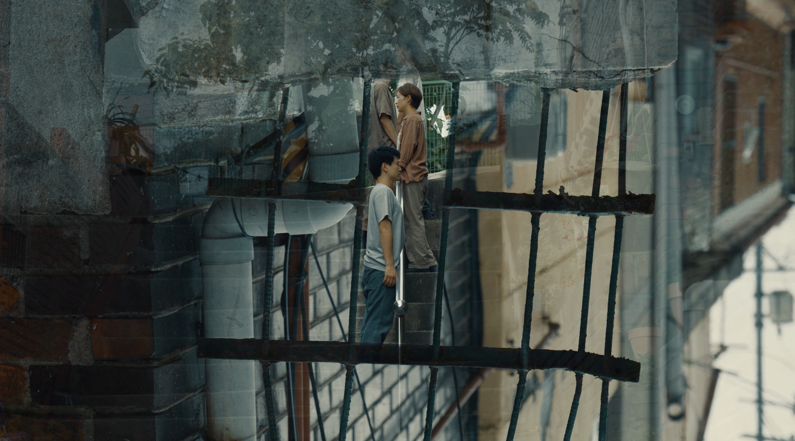

+++
title = '충현동 - 틈'
date = 2023-09-26T21:54:41+09:00
draft = false
tags = ['겹', '도시', '충현동']
lat = 37.565576
lng = 126.959772
locationLarge = '서울시'
locationSmall = '충현동'
+++



 
### 틈
벽과 벽 사이의 공간, 남는 자리들에 머무르는 존재가 있다. 어쩌면 인간이 존재하지 않기에 오래도록 자리를 지킬 수 있었던 도심 속 보호구역. 바라보지 않던 곳들, 알지 못하던 틈에 잠시 머무르다. 장소의 틈이 마련한 시간의 틈에 잠시 머무르다. 
 
 
**충현동(서대문구)** 1955년 북아현1,2,3동이었다가 2008년 5월 충정로동과 북아현3동이 통합되어 충현동으로 명칭이 변경되었다. 금화산과 함께 공기가 좋아 주택지로써 좋은 조건을 갖춰 일제 강점기 때부터 고급주택지로 개발된 곳이다. 반면에 고지대에는 일제 강점기 토막집과 더불어 한국 전쟁 이후에는 이주민이 거주하며 판잣집이 형성되었다. 불량주택을 양성화하는 정책을 펼치면서 판잣집이 시멘트 집으로 바뀌었고 형태는 지금도 남아 있다. 현재 금화산골목공원에는 1969년에 지어진 금화시범아파트가 있었으나 2015년에 철거되었다. 일제강점기 때부터 현재까지 변화된 다양한 양상의 주거 공간과 변하는 서울의 도시경관을 파노라마 형태로 볼 수 있는 지역이다. 금화산 골목공원에 서서 노을 지는 모습을 바라보고 있으면, 도시 서울이 어떤 곳인지를 다시금 곱씹게 된다.

<table class="article-credit-style">
    <tr>
    <td style="width: 100px;">디렉터</td>
    <td>노제현</td>
    </tr>
    <tr>
    <td>출연</td>
    <td>강민지, 노제현, 양석진, 천영돈</td>
    </tr>
    <tr>
    <td>장소리서치/글</td>
    <td>이경민</td>
    </tr>
    <tr>
    <td>영상감독</td>
    <td>박용호</td>
    </tr>
    <tr>
    <td>사운드디자인</td>
    <td>곽다원</td>
    </tr>
    <tr>
    <td>프로듀서/글</td>
    <td>임현진</td>
    </tr>
</table>