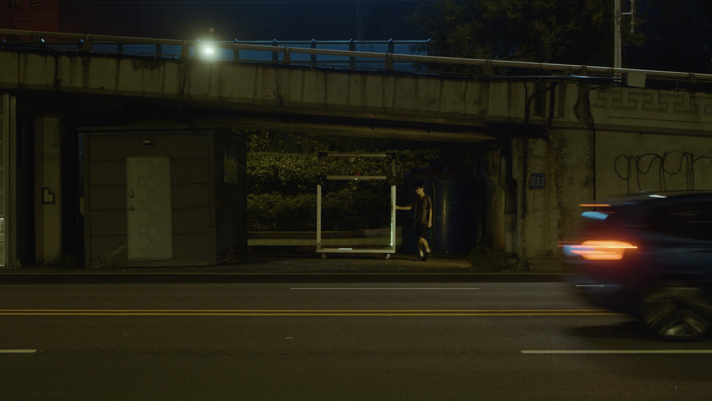

+++
title = '동부이촌동 - 경계'
date = 2023-09-26T21:54:41+09:00
draft = false
tags = ['잉여', '도시', '이촌동']
lat = 37.518651
lng = 126.984808
locationLarge = '서울시'
locationSmall = '이촌동'
+++



 
### 경계
목적이 없는 존재가 있다면, 목적이 없는 공간이 있다면. 
빛이 없는 자리가, 보이지 않는 존재가 있다면. 
분명 존재하는데, 아무도 보지 않는 존재가 있다면. 

주어진 시간은 잠시, 신호가 바뀌면 이내 사라진다.
어쩌면 존재하는 위태롭고도 아름다운 존재들을 잠시 마주한다.
 
 
**동부이촌동(용산구)** 서울의 대표적인 부촌이자 일본인이 많이 거주하고 있다. 고층의 고급 아파트와 국립중앙박물관, 용산 가족 공원, 서빙고 근린공원 등 문화시설과 공원이 있어 한껏 여유로워 보이지만 미군 부대와 철도 관련 시설이 모여 있어 역사 속에 존재했던 지배관계가 드러나는 지역이다. 철도와 도로로 단절된 듯 인적 드문 대로 아래 시선이 닿을 듯 말 듯 남겨진 잉여 공간이 있다. 갈 길 바쁜 차들 사이로 스치듯 지나는 누군가의 움직임이 포착된다.

<table class="article-credit-style">
    <tr>
    <td style="width: 100px;">디렉터</td>
    <td>노제현</td>
    </tr>
    <tr>
    <td>출연</td>
    <td>천영돈</td>
    </tr>
    <tr>
    <td>장소리서치/글</td>
    <td>이경민</td>
    </tr>
    <tr>
    <td>영상감독</td>
    <td>박용호</td>
    </tr>
    <tr>
    <td>사운드디자인</td>
    <td>곽다원</td>
    </tr>
    <tr>
    <td>프로듀서/글</td>
    <td>임현진</td>
    </tr>
</table>