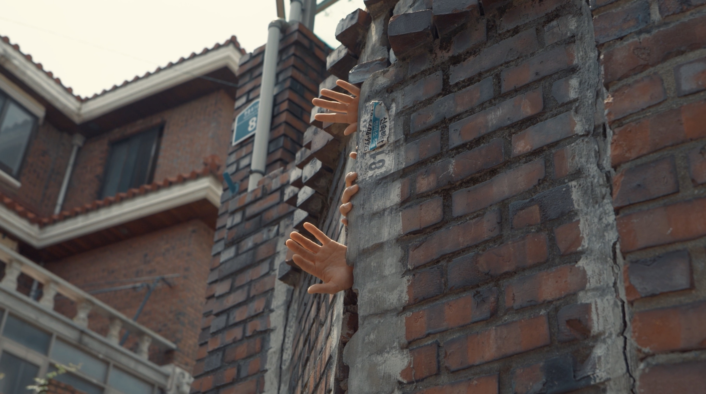

+++
title = '흑석동 - 정지된 도시'
date = 2023-09-26T21:54:41+09:00
draft = false
tags = ['정지', '도시', '흑석동']
lat = 37.504748
lng = 126.969535
locationLarge = '서울시'
locationSmall = '흑석동'
+++



 
### 정지된 도시
도시의 틈이 살아 움직인다면 어떤 모습일까. 멈춘 도시에 꿈틀대는 존재가 있다. 멈춘 시간과 틈을 몸이 메운다. 움직이는 몸의 곡선이, 몸이 장소를 기억하는 방식이, 굳은 벽을 천천히 만진다. 
 
 
**흑석동(동작구)** 일제강점기 때 ‘명수대’라 불리며 일본인들에 의해 개발된 대표적인 주택지다. 현재도 흑석동 일대에는 ‘명수대’라는 명칭을 쉽게 찾아볼 수 있다. 하지만 영상 속 흑석동은 명수대와 거리가 먼 흑석동이며 ‘비계’라는 이름을 가지고 있다. <서울학 연구 총서>에 의하면 한강 변 가파른 산비탈에 위치한 마을로, 산골짜기 개울물이 한강으로 수직으로 바로 떨어져 물이 날아가는 듯하다고 하여 ‘비계’(飛溪, 나르는 개울물)라고 했다. 국립묘지인 현충원과 서달산 둘레길 코스가 지나지만 관심 있게 보지 않으면 눈에 잘 띄지 않는다. 1970년~1980년에 지어진 다세대•다가구 밀집 지역으로, 현재 ‘흑석11구역’으로 지정되어 재개발을 앞두고 있다.

<table class="article-credit-style">
    <tr>
    <td style="width: 100px;">디렉터</td>
    <td>노제현</td>
    </tr>
    <tr>
    <td>출연</td>
    <td>강민지, 노제현, 양석진, 천영돈</td>
    </tr>
    <tr>
    <td>장소리서치/글</td>
    <td>이경민</td>
    </tr>
    <tr>
    <td>영상감독</td>
    <td>박용호</td>
    </tr>
    <tr>
    <td>사운드디자인</td>
    <td>곽다원</td>
    </tr>
    <tr>
    <td>프로듀서/글</td>
    <td>임현진</td>
    </tr>
</table>