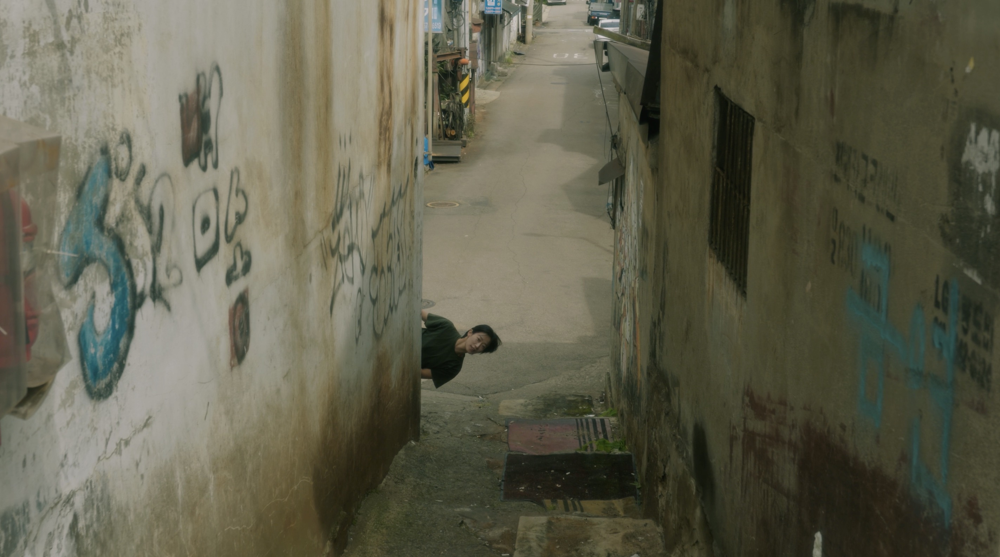

+++
title = '문래동 - 골목의 법칙'
date = 2023-09-26T21:54:41+09:00
draft = false
tags = [ '골목', '철공소' , '문래동']
lat = 37.510472
lng = 126.892404
locationLarge = '서울시'
locationSmall = '문래동'
+++



 
### 골목의 법칙
흐르기로 해, 튕기기로 해, 무게를 나눠지기로 해, 무게를 덜어내기로 해. 주어진 자리만큼만 움직이기로 해. 골목의 법칙대로, 골목의 순서대로.
 공간의 법칙을 따르기로 해. 
 
 
**문래동(영등포구)** 1936년 경성부 시절 대표적인 공업지구로 현재까지 성격이 그대로 이어져 오고 있다. 대규모 방직공장이 들어서면서 공장 노동자들이 거주하는 주택단지도 함께 조성되었다. 대표적인 곳이 문래동 4가 <영단 주택단지>다. 당시 지어졌던 주택들은 1980년대쯤부터 조금씩 변형되어 대부분 소규모 철공소로 쓰이고 있지만, 외형이 그대로 남아 있는 경우도 있다. 기차와 1호선 전철이 지나는 영등포역과 인천‧경기권 버스가 있어 교통이 편리하다. 해방 이후 미군정 시기에는 미군 시설도 있었고, 1990년대 후반까지도 공장과 기숙사가 있었을 만큼 꽤 오랫동안 공업 지구로서 역할을 해오고 있다. 현재 대규모 공장들은 아파트나 지식산업센터로 변하면서 사라졌고, 문래동1가부터 4가까지 철공소가 자리를 지키고 있다. 시기를 달리하는 다양한 요소들이 섞여 정체성을 이루고 있는 지역이자, 시간의 흐름에 따른 도시공간의 변화, 인간이 가진 오감을 느낄 수 있는 곳이다.

<table class="article-credit-style">
    <tr>
    <td style="width: 100px;">디렉터</td>
    <td>노제현</td>
    </tr>
    <tr>
    <td>출연</td>
    <td>강민지, 노제현, 양석진, 천영돈</td>
    </tr>
    <tr>
    <td>장소리서치/글</td>
    <td>이경민</td>
    </tr>
    <tr>
    <td>영상감독</td>
    <td>박용호</td>
    </tr>
    <tr>
    <td>사운드디자인</td>
    <td>곽다원</td>
    </tr>
    <tr>
    <td>프로듀서/글</td>
    <td>임현진</td>
    </tr>
</table>