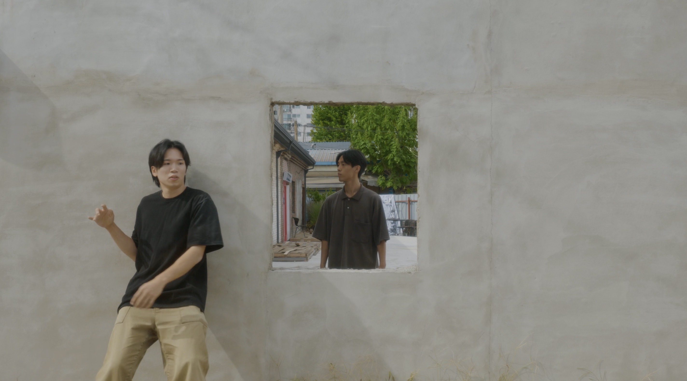

+++
title = '문래동 - 사이'
date = 2023-09-26T21:54:41+09:00
draft = false
tags = [ '골목', '철공소' , '문래동']
lat = 37.510900
lng = 126.893088
locationLarge = '서울시'
locationSmall = '문래동'
+++



 
### 사이
어디가 안이고 어디가 밖일까. 단면인줄 알았던 벽에서 어느 날 누군가 나타났다. 공간을 나누던 벽 안으로(밖으로) 들어가서(나와서) 그곳을 헤아린다. 알지 못했던 장소가 열린다.
 
 
**문래동(영등포구)** 1936년 경성부 시절 대표적인 공업지구로 현재까지 성격이 그대로 이어져 오고 있다. 대규모 방직공장이 들어서면서 공장 노동자들이 거주하는 주택단지도 함께 조성되었다. 대표적인 곳이 문래동 4가 <영단 주택단지>다. 당시 지어졌던 주택들은 1980년대쯤부터 조금씩 변형되어 대부분 소규모 철공소로 쓰이고 있지만, 외형이 그대로 남아 있는 경우도 있다. 기차와 1호선 전철이 지나는 영등포역과 인천‧경기권 버스가 있어 교통이 편리하다. 해방 이후 미군정 시기에는 미군 시설도 있었고, 1990년대 후반까지도 공장과 기숙사가 있었을 만큼 꽤 오랫동안 공업 지구로서 역할을 해오고 있다. 현재 대규모 공장들은 아파트나 지식산업센터로 변하면서 사라졌고, 문래동1가부터 4가까지 철공소가 자리를 지키고 있다. 시기를 달리하는 다양한 요소들이 섞여 정체성을 이루고 있는 지역이자, 시간의 흐름에 따른 도시공간의 변화, 인간이 가진 오감을 느낄 수 있는 곳이다.

<table class="article-credit-style">
    <tr>
    <td style="width: 100px;">디렉터</td>
    <td>노제현</td>
    </tr>
    <tr>
    <td>출연</td>
    <td>양석진, 천영돈</td>
    </tr>
    <tr>
    <td>장소리서치/글</td>
    <td>이경민</td>
    </tr>
    <tr>
    <td>영상감독</td>
    <td>박용호</td>
    </tr>
    <tr>
    <td>사운드디자인</td>
    <td>곽다원</td>
    </tr>
    <tr>
    <td>프로듀서/글</td>
    <td>임현진</td>
    </tr>
</table>

