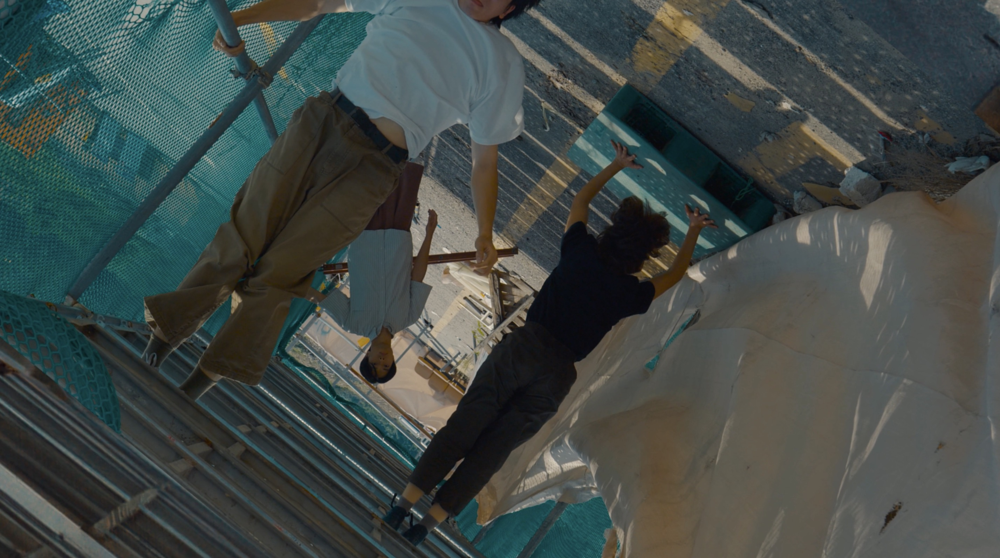

+++
title = '삼성동 - 또 다른 세계에서 만나'
date = 2023-09-26T21:54:41+09:00
draft = false
tags = ['이면', '도시', '삼성동']
lat = 37.464775
lng = 126.930147
locationLarge = '서울시'
locationSmall = '삼성동'
+++



 
### 또 다른 세계에서 만나
장소에 인사를 건넨다. 또 다른 세계에서 만나. 여전히 네가 존재하고 여전히 내가 존재하는 또 다른 평행세계가 있고, 그 세계에서 우리는 반대로 걷고 반대로 말하지. 무너지던 것들은 다시 세워지고, 세워지던 것들은 다시 무너질거야. 긴 시간의 더미를 넘어, 큰 기억의 덩어리를 지나, 우리는 또 다른 세계에서 만나.
 
 
**삼성동(관악구)** 서울시 강남구 삼성동이 아닌 관악구 삼성동이다. 1963년부터 1980년까지 신림동으로 불렸다. 경기도 시흥군이었던 시절 ‘신림리’로 불렸던 흔적이 남아 있었던 것이며, 2008년 신림6동과 신림10동이 통합되며 삼성동이 탄생하였다. 1960년대에 서울시 도심(용산 해방촌, 청계천, 한강주변, 이촌동, 대방동, 이태원 등)철거민들이 강제로 이주하여 형성된 동네다. 60여 년이 흐르는 동안 1~2차례의 재개발로 일부 지역은 아파트가 생겼지만, 대다수 지역은 1960년~1970년대 모습을 유지하며 남아 있었다. 현재 삼성동 일대는 현재 신림1구역, 2구역, 3구역으로 나뉘어 재개발이 진행되고 있다. 관악산이 가까이에 있어 도시지만 다소 시골스러운 풍경을 간직하고 있던 삼성동의 경관은 많이 바뀔 것 같은 예감이다.

<table class="article-credit-style">
    <tr>
    <td style="width: 100px;">디렉터</td>
    <td>노제현</td>
    </tr>
    <tr>
    <td>출연</td>
    <td>강민지, 양석진, 천영돈</td>
    </tr>
    <tr>
    <td>장소리서치/글</td>
    <td>이경민</td>
    </tr>
    <tr>
    <td>영상감독</td>
    <td>박용호</td>
    </tr>
    <tr>
    <td>사운드디자인</td>
    <td>곽다원</td>
    </tr>
    <tr>
    <td>프로듀서/글</td>
    <td>임현진</td>
    </tr>
</table>
